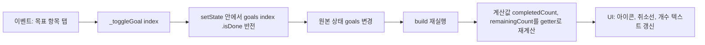

# STATE_FLOW

```mermaid
flowchart LR
  A[이벤트: 목표 항목 탭] --> B[_toggleGoal index]
  B --> C[setState 안에서 goals index .isDone 반전]
  C --> D[원본 상태 goals 변경]
  D --> E[build 재실행]
  E --> F[계산값 completedCount, remainingCount를 getter로 재계산]
  F --> G[UI: 아이콘, 취소선, 개수 텍스트 갱신]
```

## 설명
- 원본 상태: `goals` (소유자 `_HomeScreenState`)
- 계산값: `completedCount`, `remainingCount` (저장하지 않음)
- 같은 이벤트를 한 번 더 발생시키면 `isDone`이 다시 반전되어 원복된다.